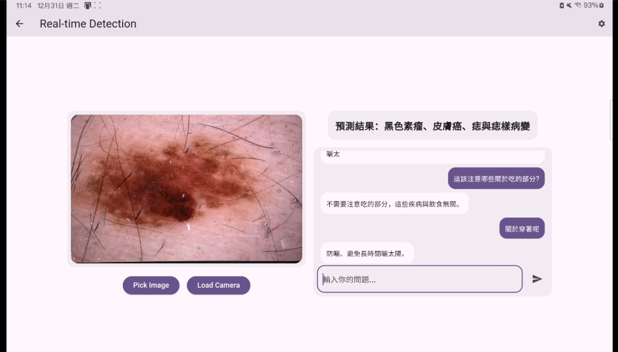

# Skin Disease AI Assistant

An integrated mobile and backend system for AI-assisted skin disease diagnosis. This project combines a lightweight image classifier and a fine-tuned large language model (LLM), supporting on-device classification and interactive medical Q&A.

## 🩺 Motivation

Diagnosing skin diseases is challenging due to diverse symptoms and appearances. This system is designed for:
- Local image classification on mobile devices
- Protecting user privacy (no cloud uploads)
- Fast diagnostic assistance
- Medical Q&A with a fine-tuned LLM

## 🔧 Features

| Feature            | Description                                             |
|-------------------|---------------------------------------------------------|
| 📱 Mobile Inference | On-device skin disease detection using MobileNetV2     |
| 🧠 LLM Chatbot       | Fine-tuned LLaMA for answering medical questions       |
| 🔐 Privacy-Focused   | No cloud dependency; all inference is offline          |

## 🧠 Models

### Image Classifier
- Backbone: MobileNetV2 (TFLite)
- Trained on mixed dermatology datasets
- Deployed for local mobile inference

### Language Model
- Backbone: LLaMA3 + LoRA (via Unsloth)
- Efficient low-rank fine-tuning
- Config files and tokenizer stored in `lora_model/` (ignored from Git)

## 🖼️ Demo

  

## 📸 How It Works

Users can either **take a photo** or **upload an image** of their skin condition.  
Here's the full inference pipeline:

1. 📷 **User takes or uploads a skin image**
2. 📱 **The mobile app executes a lightweight TFLite-based skin disease detection model locally**
   - All inference runs **on-device**, ensuring privacy and low latency
3. 🔁 **The prediction result is sent to the backend**
4. 🤖 **The backend interacts with a fine-tuned LLaMA3-based LLM**
   - The LLM generates medical Q&A responses based on the prediction
   - For example: condition explanations, next steps, related symptoms

